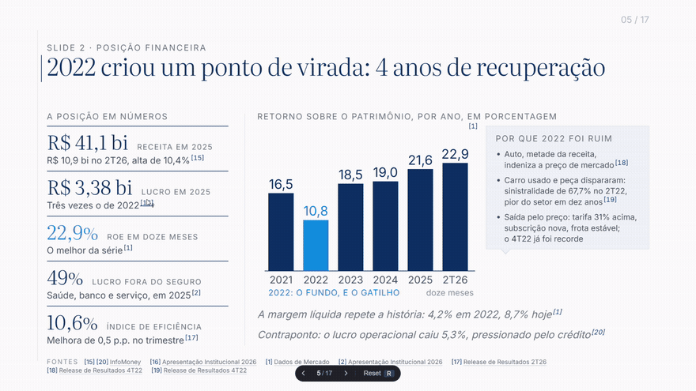
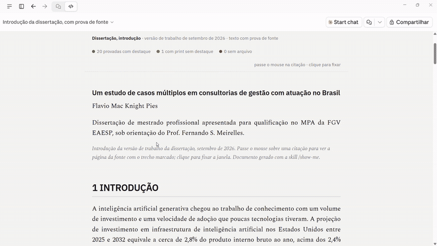

# show-me

Uma skill para o Claude Code e o Claude Cowork: **cada dado do texto sai com a prova junto**.

Para cada número, citação ou afirmação, a skill acha a fonte primária, captura o print da
página com o trecho destacado em amarelo e monta uma ficha de prova — de onde veio, quem
publicou, quando, o trecho literal e o link para a página exata. No documento final, passar
o mouse sobre a citação abre essa ficha.

O ganho não é só de auditoria. Obrigada a abrir cada fonte e a colar o trecho de lá, a
própria IA encontra e corrige erros que ela mesma cometeu: número trocado, link morto, data
errada, citação que a fonte não sustenta.

📄 **[Por que criei esta skill](https://flaviomacknightpies.substack.com/p/peca-para-a-ia-te-mostrar-a-fonte)** — o artigo com os dois casos abaixo, e o que o print derrubou em cada um.

## Como fica

Num deck de análise: cada número abre a ficha com a fonte, e o rodapé de cada página lista
as fontes que aparecem ali.



Num texto acadêmico: o mouse sobre a citação abre a página do PDF original, com o número
localizado e o trecho destacado.



## Instalar

No **Claude Code**:

```
/plugin marketplace add flaviomkpies/show-me
/plugin install show-me@show-me
```

No **Claude Cowork**: Personalizar, Plugins, Adicionar, Adicionar marketplace, Adicionar de
um repositório, e colar `flaviomkpies/show-me`. Deixe ligado o "Atualizar automaticamente"
para receber as versões novas.

## Antes do primeiro uso

Leia o **`plugins/show-me/ONBOARDING.md`**. São três minutos: duas bibliotecas Python
(`pymupdf` e `requests`) e um e-mail de contato para as APIs abertas de artigo científico.

## Usar

```
show-me neste relatório
```

Ou, dentro de um pedido maior: "escreva a seção e passe o show-me em cada número".

## Licença

MIT (`LICENSE`). Use, modifique e redistribua como achar melhor. Se ajudou, uma estrela no
repositório ajuda outras pessoas a encontrar a skill.
